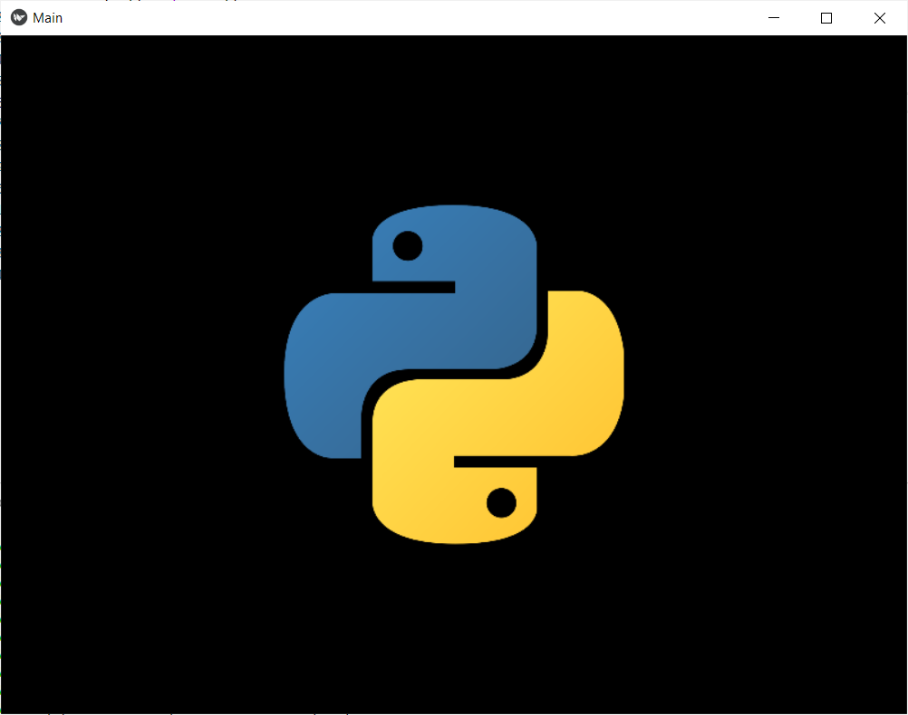

# Kivy

https://realpython.com/mobile-app-kivy-python/

## Hello World

```python
from kivy.app import App
from kivy.uix.label import Label

class MainApp(App):
    def build(self):
        label = Label(text='Hello from Kivy',
                      size_hint=(.5, .5),
                      pos_hint={'center_x': .5, 'center_y': .5})

        return label

if __name__ == '__main__':
    app = MainApp()
    app.run()
```

## Image

```python
from kivy.app import App
from kivy.uix.image import Image

class MainApp(App):
    def build(self):
        img = Image(source='python.png',
                    size_hint=(1, .5),
                    pos_hint={'center_x':.5, 'center_y':.5})

        return img

if __name__ == '__main__':
    app = MainApp()
    app.run()
```


https://kivy.org/doc/stable/api-kivy.uix.image.html

**Image from URL**: [hellogoURL.py](hellogoURL.py)

## Camera

https://kivy.org/doc/stable/examples/gen__camera__main__py.html


https://stackoverflow.com/questions/14910065/accessing-android-camera-through-kivy
https://github.com/kivy/plyer